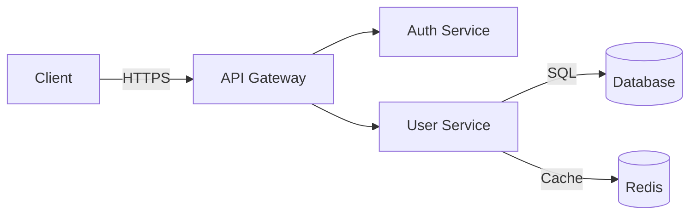

# Knowledge Transfer

**ID:** pro-001  
**Category:** Project Management  
**Priority:** HIGH  
**Complexity:** Intermediate  
**Estimated Time:** 30-90 minutes  
**Last Updated:** 2025-10-26

---

## Purpose

**What:** Systematically document and transfer knowledge to enable team members, future developers, or your future self to understand and maintain code

**Why:** Undocumented knowledge creates single points of failure, slows onboarding, and leads to maintenance nightmares. Good knowledge transfer multiplies team productivity and prevents "bus factor" risks

**When to use:**
- Onboarding new team members
- Before leaving a project or company
- After building a complex feature
- When you're the only one who understands a system
- Before vacation or extended absence
- When tribal knowledge exists only in your head
- After incident response or debugging session
- When creating reusable patterns or libraries

---

## Prerequisites

**Required:**
- [ ] Understanding of the system/code to document
- [ ] Target audience identified (who needs this knowledge?)
- [ ] Time to create thorough documentation
- [ ] Access to codebase and related resources

**Check before starting:**
```bash
# Verify you have necessary access
git log --oneline -20
ls -la README.md docs/

# Check existing documentation
find . -name "*.md" | grep -v node_modules
grep -r "TODO\|FIXME" docs/

# Identify what needs documentation
git log --author="$(git config user.name)" --since="1 month ago" --oneline
```

---

## Implementation Steps

### Step 1: Identify Knowledge Transfer Scope

**What:** Determine what knowledge needs to be transferred and to whom

**How:**

**Assess Your Unique Knowledge:**

```markdown
## Knowledge Audit

What do I know that others don't?

### System Knowledge
- [ ] Architecture decisions and rationale
- [ ] System boundaries and dependencies
- [ ] Performance characteristics
- [ ] Known limitations

### Code Knowledge  
- [ ] Complex algorithms or business logic
- [ ] Tricky edge cases
- [ ] Workarounds and why they exist
- [ ] Code patterns and conventions

### Process Knowledge
- [ ] Deployment procedures
- [ ] Debugging techniques
- [ ] Common issues and solutions
- [ ] Testing strategies

### Domain Knowledge
- [ ] Business rules and context
- [ ] User workflows
- [ ] Regulatory requirements
- [ ] Historical context

### Operational Knowledge
- [ ] Monitoring and alerts
- [ ] Incident response procedures
- [ ] Performance tuning
- [ ] Configuration management
```

**Identify Your Audience:**

| Audience | Knowledge Level | What They Need |
|----------|----------------|----------------|
| **New Hire** | None | Everything from setup to deployment |
| **Junior Dev** | Basic | How-to guides, examples, gotchas |
| **Senior Dev** | Advanced | Architecture, design decisions, edge cases |
| **Different Team** | Domain-specific | Integration points, APIs, dependencies |
| **Future You** | All | Rationale, gotchas, maintenance notes |
| **On-call Engineer** | Operational | Runbooks, troubleshooting, monitoring |

**Prioritization Matrix:**

```
        UNIQUE KNOWLEDGE    COMMON KNOWLEDGE
HIGH    ┌─────────────────┐ ┌─────────────────┐
IMPACT  │ DOCUMENT FIRST  │ │ DOCUMENT IF     │
        │ - Architecture  │ │   TIME          │
        │ - Critical bugs │ │ - Standard      │
        │ - Key decisions │ │   patterns      │
        └─────────────────┘ └─────────────────┘
        
LOW     ┌─────────────────┐ ┌─────────────────┐
IMPACT  │ DOCUMENT SOON   │ │ SKIP/LOW        │
        │ - Edge cases    │ │   PRIORITY      │
        │ - Workarounds   │ │ - Obvious code  │
        └─────────────────┘ └─────────────────┘
```

**Create Documentation Plan:**

```markdown
# Knowledge Transfer Plan - [Project Name]

## Priority 1: Critical (Must Have)
- [ ] System architecture overview
- [ ] Getting started guide
- [ ] Deployment process
- [ ] Incident response runbook

## Priority 2: Important (Should Have)  
- [ ] Code organization and patterns
- [ ] Testing guide
- [ ] API documentation
- [ ] Common troubleshooting

## Priority 3: Nice to Have
- [ ] Historical context
- [ ] Performance optimization guide
- [ ] Advanced topics
- [ ] Future roadmap

## Timeline
- Week 1: Priority 1 items
- Week 2: Priority 2 items  
- Ongoing: Priority 3 items

## Format
- Written docs: docs/ directory
- Video: For complex workflows
- Code comments: For tricky logic
- Runbooks: For operational tasks
```

**Verification:**
- [ ] Identified unique knowledge you possess
- [ ] Know who the audience is
- [ ] Prioritized what to document
- [ ] Created a plan and timeline
- [ ] Scope is achievable

**If This Fails:**
→ Start with most critical: "If I'm unavailable, what breaks?"
→ Ask team: "What do you need to know about X?"
→ Review recent questions asked by teammates

---

### Step 2: Create System Overview Documentation

**What:** Provide high-level understanding of the system architecture and design

**How:**

**System Overview Template:**

```markdown
# [System Name] - System Overview

**Last Updated:** [Date]
**Owner:** [Team/Person]
**Status:** [Production/Beta/Development]

---

## What This System Does

**Elevator Pitch:**
[1-2 sentences describing the system's purpose in plain language]

**Key Features:**
- Feature 1: [Brief description]
- Feature 2: [Brief description]
- Feature 3: [Brief description]

**Target Users:**
[Who uses this system and how]

---

## Architecture Overview

**High-Level Diagram:**
```
┌──────────────┐      ┌──────────────┐      ┌──────────────┐
│   Client     │─────▶│  API Server  │─────▶│  Database    │
│  (React)     │      │  (FastAPI)   │      │ (PostgreSQL) │
└──────────────┘      └──────────────┘      └──────────────┘
                             │
                             ▼
                      ┌──────────────┐
                      │   Cache      │
                      │  (Redis)     │
                      └──────────────┘
```

**Components:**

### 1. API Server
- **Purpose:** Handle HTTP requests and business logic
- **Technology:** Python FastAPI
- **Key Files:** `src/api/`, `src/models/`
- **Responsibilities:**
  - Authentication and authorization
  - Business logic execution
  - Data validation

### 2. Database
- **Purpose:** Persistent data storage
- **Technology:** PostgreSQL 14
- **Schema:** See `docs/schema.md`
- **Key Tables:** users, products, orders

### 3. Cache Layer
- **Purpose:** Performance optimization
- **Technology:** Redis
- **What's Cached:** User sessions, product catalog
- **TTL:** 1 hour default

**Data Flow:**

```
User Request → API Auth → Validation → Business Logic → Database
                                              ↓
                                          Cache Check
                                              ↓
                                     Return Response
```

---

## Technology Stack

| Layer | Technology | Version | Why Chosen |
|-------|------------|---------|------------|
| Frontend | React | 18.2 | Component reusability, ecosystem |
| Backend | FastAPI | 0.104 | Performance, async support, OpenAPI |
| Database | PostgreSQL | 14 | ACID compliance, JSON support |
| Cache | Redis | 7 | Speed, data structures |
| Deployment | Docker | 24 | Consistency across environments |

---

## Key Design Decisions

### Decision 1: Why FastAPI Over Flask
**Decision:** Use FastAPI for the backend API
**Rationale:**
- Native async/await support (better performance)
- Automatic OpenAPI documentation
- Type hints and validation with Pydantic
- Modern Python 3.10+ features

**Trade-offs:**
- ✅ Better performance
- ✅ Better developer experience
- ❌ Steeper learning curve than Flask
- ❌ Smaller ecosystem

**When to reconsider:**
- If async not needed
- If team unfamiliar with modern Python

### Decision 2: PostgreSQL Over NoSQL
**Decision:** Use PostgreSQL as primary database
**Rationale:**
- ACID transactions required for orders
- Complex queries needed for reporting
- Relational data model fits domain well

**Trade-offs:**
- ✅ Data integrity
- ✅ Rich query capabilities
- ❌ Scaling requires more effort than NoSQL
- ❌ Schema migrations can be tricky

---

## System Boundaries

**What This System Does:**
- User authentication and management
- Product catalog and search
- Order processing
- Payment integration (via Stripe)

**What This System Does NOT Do:**
- Inventory management (separate service)
- Email sending (uses SendGrid API)
- Image hosting (uses S3)
- Analytics (uses Amplitude)

**External Dependencies:**
- Stripe API: Payment processing
- SendGrid: Email delivery
- AWS S3: File storage
- Auth0: SSO integration (optional)

---

## Known Limitations

1. **Scalability:**
   - Current: Handles ~1000 req/sec
   - Bottleneck: Database connections
   - Solution: Add read replicas when traffic grows

2. **Search:**
   - Simple text search, not full-text
   - Consider Elasticsearch for advanced search

3. **Real-time:**
   - No WebSocket support yet
   - Updates via polling
   - Plan: Add WebSockets in Q2

4. **Internationalization:**
   - English only currently
   - i18n infrastructure in place but untranslated

---

## Resources

- **Code Repository:** [GitHub URL]
- **Documentation:** `docs/` directory
- **API Docs:** http://api.example.com/docs (auto-generated)
- **Monitoring:** [Datadog/Grafana URL]
- **Project Management:** [Jira/Linear URL]
- **Slack Channel:** #team-backend

## Quick Links
- [Getting Started Guide](./getting-started.md)
- [API Reference](./api-reference.md)
- [Deployment Guide](./deployment.md)
- [Troubleshooting](./troubleshooting.md)
```

**Architecture Diagram Tips:**

```bash
# Tools for creating diagrams
# 1. Text-based (easy to version control)
#    - Mermaid (built into GitHub)
#    - PlantUML
#    - ASCII art

# 2. Visual (more polished)
#    - draw.io (free, exports to PNG/SVG)
#    - Lucidchart
#    - Excalidraw (simple, web-based)

# Example Mermaid diagram in markdown:

```

**Verification:**
- [ ] System purpose is clear
- [ ] Architecture diagram shows major components
- [ ] Technology choices documented with rationale
- [ ] Design decisions explained
- [ ] Boundaries and limitations stated
- [ ] Resources and links provided

**If This Fails:**
→ Start simple: bullet points and ASCII diagrams
→ Iteratively improve over time
→ Ask someone to review: "Does this make sense?"

---

### Step 3: Document Getting Started Process

**What:** Create step-by-step guide for new developers to set up and run the project

**How:**

**Getting Started Guide Template:**

```markdown
# Getting Started Guide - [Project Name]

**Goal:** Get the project running locally in < 30 minutes

---

## Prerequisites

### Required Software
- [ ] Python 3.11+ ([Download](https://python.org))
- [ ] PostgreSQL 14+ ([Download](https://postgresql.org))
- [ ] Redis 7+ ([Download](https://redis.io))
- [ ] Git ([Download](https://git-scm.com))

### Optional Tools
- [ ] Docker Desktop (easier setup)
- [ ] VS Code (recommended IDE)
- [ ] Postman (API testing)

### Verify Installation
```bash
python --version  # Should show 3.11+
psql --version    # Should show 14+
redis-cli --version  # Should show 7+
git --version
```

---

## Step 1: Clone Repository

```bash
# Clone the repo
git clone https://github.com/company/project.git
cd project

# Verify you're on main branch
git branch
# Should show: * main
```

---

## Step 2: Set Up Python Environment

```bash
# Create virtual environment
python -m venv venv

# Activate virtual environment
# On macOS/Linux:
source venv/bin/activate
# On Windows:
venv\Scripts\activate

# Verify activation (prompt should show (venv))
which python
# Should show: /path/to/project/venv/bin/python

# Install dependencies
pip install -r requirements.txt

# Verify installation
pip list | grep fastapi
# Should show fastapi and its version
```

---

## Step 3: Set Up Database

```bash
# Start PostgreSQL (if not running)
# macOS with Homebrew:
brew services start postgresql

# Linux:
sudo systemctl start postgresql

# Create database
createdb myproject_dev

# Run migrations
python manage.py migrate

# Verify
psql myproject_dev -c "\dt"
# Should show list of tables
```

---

## Step 4: Configure Environment

```bash
# Copy environment template
cp .env.example .env

# Edit .env with your settings
# Required variables:
#   DATABASE_URL=postgresql://localhost/myproject_dev
#   SECRET_KEY=generate-random-key-here
#   STRIPE_TEST_KEY=sk_test_... (get from team)

# Generate secret key
python -c "import secrets; print(secrets.token_urlsafe(32))"

# Paste result into .env for SECRET_KEY
```

**Example .env:**
```bash
# Database
DATABASE_URL=postgresql://localhost/myproject_dev

# Security
SECRET_KEY=your-secret-key-here

# External Services
STRIPE_TEST_KEY=sk_test_... (ask team for this)
SENDGRID_API_KEY=SG.... (optional for email)

# Development
DEBUG=True
LOG_LEVEL=INFO
```

---

## Step 5: Start Services

```bash
# Terminal 1: Start Redis
redis-server

# Terminal 2: Start API server
python manage.py runserver
# Should see: "Uvicorn running on http://127.0.0.1:8000"

# Terminal 3: Run tests to verify
pytest tests/
# Should see all tests passing

# Optional Terminal 4: Start frontend (if applicable)
cd frontend/
npm install
npm run dev
```

---

## Step 6: Verify Everything Works

### 1. Check API Health
```bash
curl http://localhost:8000/health
# Should return: {"status": "ok"}
```

### 2. Check API Docs
Open browser to: http://localhost:8000/docs
- Should see interactive API documentation

### 3. Create Test User
```bash
curl -X POST http://localhost:8000/api/users/ \
  -H "Content-Type: application/json" \
  -d '{"email": "test@example.com", "password": "testpass123"}'

# Should return user object with ID
```

### 4. Run Full Test Suite
```bash
pytest tests/ -v
# All tests should pass
```

---

## Common Issues

### Issue: Port 8000 Already in Use
```bash
# Find what's using port 8000
lsof -i :8000

# Kill it
kill -9 <PID>

# Or run on different port
python manage.py runserver --port 8001
```

### Issue: Database Connection Failed
```bash
# Check PostgreSQL is running
pg_isready

# If not running:
brew services start postgresql  # macOS
sudo systemctl start postgresql  # Linux

# Check database exists
psql -l | grep myproject
```

### Issue: Module Not Found
```bash
# Ensure venv is activated
which python
# Should show venv path

# Reinstall dependencies
pip install -r requirements.txt --force-reinstall
```

### Issue: Tests Failing
```bash
# Make sure you're using test database
export DATABASE_URL=postgresql://localhost/myproject_test

# Recreate test database
dropdb myproject_test
createdb myproject_test
python manage.py migrate
```

---

## Next Steps

✅ You now have the project running locally!

**What to do next:**
1. Read [Architecture Overview](./architecture.md)
2. Check out [Code Style Guide](./code-style.md)
3. Pick a "good first issue" from GitHub Issues
4. Join #team-backend on Slack
5. Schedule onboarding call with team lead

**Learning Resources:**
- FastAPI Tutorial: https://fastapi.tiangolo.com/tutorial/
- PostgreSQL Docs: https://www.postgresql.org/docs/
- Our Wiki: [URL]

---

## Getting Help

**Stuck?** Don't struggle alone!

- 💬 Slack: #team-backend
- 📧 Email: backend-team@company.com
- 🐛 Bug? Create GitHub issue
- ❓ Questions: Ask in daily standup

**Team Contact:**
- Tech Lead: @alice (Slack)
- Backend: @bob, @charlie  
- DevOps: @david
```

**Additional Setup Materials:**

**setup.sh Script:**
```bash
#!/bin/bash
# setup.sh - Automated setup script

set -e  # Exit on error

echo "🚀 Setting up project..."

# Check prerequisites
command -v python3 >/dev/null 2>&1 || { echo "Python 3 required but not installed."; exit 1; }
command -v psql >/dev/null 2>&1 || { echo "PostgreSQL required but not installed."; exit 1; }

# Create venv
echo "📦 Creating virtual environment..."
python3 -m venv venv
source venv/bin/activate

# Install dependencies
echo "📥 Installing dependencies..."
pip install -r requirements.txt

# Setup database
echo "🗄️  Setting up database..."
createdb myproject_dev || echo "Database already exists"
python manage.py migrate

# Copy env file
if [ ! -f .env ]; then
    echo "⚙️  Creating .env file..."
    cp .env.example .env
    echo "⚠️  Remember to edit .env with your configuration!"
fi

# Run tests
echo "🧪 Running tests..."
pytest tests/ -v

echo "✅ Setup complete! Run 'source venv/bin/activate && python manage.py runserver' to start."
```

**Verification:**
- [ ] Prerequisites listed clearly
- [ ] Step-by-step instructions work
- [ ] Common issues documented
- [ ] Verification steps included
- [ ] Next steps provided
- [ ] Can complete setup in < 30 minutes

**If This Fails:**
→ Have someone new try the guide and note pain points
→ Add more detail to confusing steps
→ Create setup script to automate

---

### Step 4: Create Code Documentation

**What:** Document code patterns, conventions, and complex logic

**How:**

**Code Documentation Levels:**

**Level 1: README (Every Project)**
```markdown
# Project Name

Brief description

## Installation
[Getting started link]

## Usage
```python
from myproject import MyClass

client = MyClass()
result = client.do_something()
```

## Documentation
See `docs/` directory

## Contributing
See CONTRIBUTING.md
```

**Level 2: API Documentation (Public APIs)**
```python
# Use docstrings that generate docs (Sphinx, pydoc, etc.)

def process_payment(amount: int, token: str, idempotency_key: str) -> Payment:
    """
    Process a payment using Stripe.
    
    Args:
        amount: Payment amount in cents (e.g., 1000 = $10.00)
        token: Stripe token from client-side (tok_...)
        idempotency_key: Unique key to prevent duplicate charges
        
    Returns:
        Payment object with status and transaction ID
        
    Raises:
        PaymentError: If payment fails (card declined, etc.)
        ValidationError: If amount <= 0 or token invalid
        
    Example:
        >>> payment = process_payment(
        ...     amount=1000,
        ...     token='tok_visa',
        ...     idempotency_key='order_12345'
        ... )
        >>> payment.status
        'succeeded'
        
    Notes:
        - Amount must be in cents, not dollars
        - Idempotency key prevents duplicate charges if client retries
        - Uses Stripe test keys in development
        
    See Also:
        - Stripe docs: https://stripe.com/docs/api/charges/create
        - Our payment guide: docs/payments.md
    """
```

**Level 3: Complex Logic Comments**
```python
# Comment the "why", not the "what"

# ❌ BAD: States the obvious
# Loop through items
for item in items:
    # Add to total
    total += item.price

# ✅ GOOD: Explains rationale
# We need to calculate total BEFORE applying discount
# because discount calculation depends on subtotal tiers
for item in items:
    total += item.price

# ✅ EXCELLENT: Explains gotchas
# Calculate total first - DO NOT MOVE THIS AFTER DISCOUNT
# The discount_tier() function has side effects that modify
# the cart state, so we need the subtotal before calling it.
# See bug #1234 for what happens if you change the order.
for item in items:
    total += item.price
```

**Level 4: Architecture Decision Records (ADRs)**

```markdown
# ADR-001: Use FastAPI Instead of Flask

**Date:** 2024-03-15
**Status:** Accepted
**Deciders:** Alice, Bob, Charlie

## Context
We need to choose a web framework for our new API. Main candidates: Flask, FastAPI, Django REST.

## Decision
We will use FastAPI.

## Rationale

### Pros of FastAPI:
- Native async/await support → 2-3x better performance
- Automatic OpenAPI docs → saves documentation time
- Pydantic validation → type safety, fewer bugs
- Modern Python 3.10+ → latest features

### Cons of FastAPI:
- Newer → smaller community than Flask
- Learning curve → async can be tricky
- Team familiarity → we know Flask better

### Alternatives Considered:

**Flask:**
- ✅ Team is familiar
- ✅ Large ecosystem
- ❌ No native async
- ❌ Manual validation

**Django REST:**
- ✅ Batteries included
- ✅ ORM included
- ❌ Too heavyweight for our needs
- ❌ Slower performance

## Consequences

**Positive:**
- Better performance from day one
- Automatic API documentation
- Type safety reduces bugs

**Negative:**
- Team needs to learn async patterns
- Smaller community for support

**Mitigation:**
- Training sessions on async Python
- Start with simple synchronous endpoints
- FastAPI docs are excellent

## References
- FastAPI benchmarks: [link]
- Team discussion: Slack #architecture 2024-03-10
- POC code: branch `spike/fastapi`
```

**Docstring Standards:**

```markdown
# Team Docstring Standard

## Functions/Methods
Use Google-style docstrings:

```python
def function_name(arg1: type, arg2: type = default) -> return_type:
    """Short one-line summary.
    
    Longer description if needed. Can be multiple paragraphs.
    Explain what the function does, not how it does it.
    
    Args:
        arg1: Description of arg1
        arg2: Description of arg2 (default: value)
        
    Returns:
        Description of return value
        
    Raises:
        ErrorType: When this error occurs
        
    Example:
        >>> function_name(1, 2)
        3
        
    Note:
        Any important notes or gotchas
    """
```

## Classes
```python
class ClassName:
    """Short description.
    
    Longer description explaining purpose and usage.
    
    Attributes:
        attr1: Description
        attr2: Description
        
    Example:
        >>> obj = ClassName()
        >>> obj.method()
    """
```

## Modules
At top of file:
```python
"""
Module short description.

Longer description of module purpose and contents.

Typical usage:
    from mymodule import MyClass
    obj = MyClass()
"""
```

**Verification:**
- [ ] Public APIs fully documented
- [ ] Complex logic has explanatory comments
- [ ] Architecture decisions recorded
- [ ] Code follows team standards
- [ ] Documentation generates correctly

**If This Fails:**
→ Start with public APIs only
→ Add comments during code review
→ Use linting tools to enforce docstrings

---

### Step 5: Create Operational Runbooks

**What:** Document procedures for deploying, monitoring, and troubleshooting the system

**How:**

**Deployment Runbook Template:**

```markdown
# Deployment Runbook

## Pre-Deployment Checklist

### Preparation (1 day before)
- [ ] All tests passing in CI
- [ ] Code review completed
- [ ] QA approval received
- [ ] Deployment window scheduled
- [ ] Team notified in #deployments
- [ ] Rollback plan ready

### Verification (1 hour before)
- [ ] Staging deployment successful
- [ ] Smoke tests passed in staging
- [ ] Database migrations tested
- [ ] No active incidents
- [ ] On-call engineer available

---

## Deployment Steps

### Step 1: Pre-Flight Checks (5 min)
```bash
# Verify production is healthy
curl https://api.prod.example.com/health
# Should return: {"status": "ok", "version": "1.2.3"}

# Check monitoring
# → Grafana dashboard: no alerts
# → Error rate: < 0.1%
# → Response time: < 100ms p95

# Backup database
./scripts/backup-db.sh production
```

### Step 2: Deploy Backend (15 min)
```bash
# Pull latest code
git fetch origin
git checkout v1.3.0  # Use specific tag, not main

# Build Docker image
docker build -t myapp:1.3.0 .

# Push to registry
docker push myapp:1.3.0

# Deploy to Kubernetes
kubectl set image deployment/api api=myapp:1.3.0

# Watch rollout
kubectl rollout status deployment/api
# Wait for: "successfully rolled out"

# Verify pods are running
kubectl get pods -l app=api
# Should show: Running x/x
```

### Step 3: Run Migrations (5 min)
```bash
# CAUTION: Migrations are irreversible
# Ensure you have database backup!

# Run migrations
kubectl exec -it api-pod -- python manage.py migrate

# Verify
kubectl exec -it api-pod -- python manage.py showmigrations
# All migrations should be checked [X]
```

### Step 4: Smoke Test (5 min)
```bash
# Test critical endpoints
curl https://api.prod.example.com/health
curl https://api.prod.example.com/api/users/me \
  -H "Authorization: Bearer $TEST_TOKEN"

# Check logs for errors
kubectl logs -l app=api --tail=100 | grep ERROR
# Should be clean (no errors)

# Monitor metrics
# → Response time stable
# → Error rate normal
# → Memory/CPU normal
```

### Step 5: Deploy Frontend (10 min)
```bash
cd frontend/

# Build production assets
npm run build

# Deploy to CDN
aws s3 sync build/ s3://myapp-frontend-prod/ \
  --delete \
  --cache-control "max-age=31536000,public"

# Invalidate CloudFront cache
aws cloudfront create-invalidation \
  --distribution-id E1234567890 \
  --paths "/*"

# Verify
curl https://example.com | grep "version"
# Should show new version
```

### Step 6: Post-Deployment Validation (10 min)
```bash
# Run automated tests
./scripts/prod-smoke-tests.sh

# Manual checks:
# 1. Login flow works
# 2. Create test entity
# 3. Check critical user journeys
# 4. Verify emails sending

# Monitor for 30 minutes
# Watch: Grafana dashboard
# Check: Error tracking (Sentry)
# Alert: #deployments channel
```

---

## Rollback Procedure

### When to Rollback
- Critical bug discovered
- Error rate > 5%
- Performance degradation > 50%
- Data corruption suspected

### Rollback Steps (5 min)
```bash
# 1. Rollback backend
kubectl rollout undo deployment/api

# 2. Verify rollback
kubectl rollout status deployment/api
kubectl get pods -l app=api

# 3. Rollback frontend
aws s3 sync s3://myapp-frontend-backup/ s3://myapp-frontend-prod/ \
  --delete
aws cloudfront create-invalidation \
  --distribution-id E1234567890 \
  --paths "/*"

# 4. Rollback database (if migrations ran)
# ⚠️ DANGEROUS - Only if absolutely necessary
kubectl exec -it api-pod -- python manage.py migrate app_name previous_migration_name

# 5. Announce rollback
# Post in #deployments and #incidents
```

### After Rollback
- [ ] Incident report created
- [ ] Root cause analysis scheduled
- [ ] Bug fix prioritized
- [ ] Tests added to prevent recurrence

---

## Troubleshooting

### Issue: Deployment Stuck
**Symptoms:** kubectl rollout status shows "Waiting for deployment..."

**Solution:**
```bash
# Check pod status
kubectl describe pod <pod-name>

# Common causes:
# - Image pull failed → Check registry access
# - Readiness probe failing → Check /health endpoint
# - Resource limits → Check CPU/memory

# View logs
kubectl logs <pod-name>
```

### Issue: High Error Rate After Deploy
**Symptoms:** Sentry shows increased errors

**Steps:**
1. Check logs for stack traces
2. Compare to previous version behavior
3. Check if specific endpoint or all
4. Decision: rollback or hotfix?

### Issue: Database Migration Failed
**Symptoms:** Migration error in logs

**Steps:**
1. **DO NOT** rollback automatically
2. Check database state
3. Consult DBA
4. May need manual SQL fix
5. Document in incident report

---

## Monitoring

**During Deployment:**
- Watch Grafana: https://grafana.example.com/d/api-overview
- Check Sentry: https://sentry.io/myorg/myapp
- Monitor #alerts channel

**Key Metrics:**
- Error rate: < 0.5%
- Response time p95: < 200ms
- CPU usage: < 70%
- Memory usage: < 80%

**Alerts:**
- Critical: Page on-call immediately
- Warning: Post in #engineering
- Info: Log only

---

## Contacts

**Deployment Lead:** @alice
**On-Call Engineer:** Use PagerDuty schedule
**DevOps:** @bob (EU hours), @charlie (US hours)
**Database:** @david

**Emergency Hotline:** +1-555-DEPLOY (24/7)
```

**Incident Response Runbook:**

```markdown
# Incident Response Runbook

## Severity Levels

| Level | Description | Response Time | Example |
|-------|-------------|---------------|---------|
| **P0** | System down | Immediate | Total outage |
| **P1** | Major degradation | < 15 min | 50% error rate |
| **P2** | Minor issue | < 1 hour | Slow response time |
| **P3** | Low impact | < 1 day | UI bug |

---

## P0: System Down

### Immediate Actions (First 5 minutes)
1. **Alert team:**
   - Post in #incidents: "P0 incident - [brief description]"
   - Page on-call via PagerDuty
   - Start incident call: [Zoom/Google Meet link]

2. **Assess impact:**
   - Check monitoring: All services down or just one?
   - Check status page: https://status.example.com
   - Customer reports: Check support tickets

3. **Quick diagnosis:**
   ```bash
   # Check service health
   kubectl get pods --all-namespaces
   
   # Check recent deployments
   kubectl rollout history deployment/api
   
   # Check logs
   kubectl logs -l app=api --tail=100
   ```

### Mitigation (Next 10 minutes)
- **If recent deploy:** Rollback immediately
- **If external service:** Check status pages (AWS, Stripe, etc.)
- **If database:** Check connections and queries
- **If traffic spike:** Enable rate limiting / scale up

### Communication
- Update #incidents every 10 minutes
- Update status page
- Notify customer support
- Update stakeholders

### After Resolution
- [ ] Write incident report
- [ ] Schedule postmortem (within 48 hours)
- [ ] Identify action items
- [ ] Update runbooks

---

## Common Issues Quick Reference

### API Returning 500 Errors
```bash
# Check logs
kubectl logs -l app=api --tail=50 | grep ERROR

# Common causes:
# - Database connection pool exhausted
# - External service timeout
# - Unhandled exception

# Quick fixes:
# - Restart pods: kubectl rollout restart deployment/api
# - Scale up: kubectl scale deployment/api --replicas=10
```

### Database Connection Issues
```bash
# Check connections
psql $DATABASE_URL -c "SELECT count(*) FROM pg_stat_activity;"

# If too many connections:
# - Restart application (releases connections)
# - Check for connection leaks in code

# Emergency: Increase connection limit (temporary)
ALTER SYSTEM SET max_connections = 200;
SELECT pg_reload_conf();
```

### High Memory Usage
```bash
# Identify memory-hungry pods
kubectl top pods

# Check for memory leaks
# - Review recent code changes
# - Check for unclosed connections
# - Look for large in-memory caches

# Quick fix:
kubectl rollout restart deployment/api
```

---

## Tools

- **Monitoring:** Grafana https://grafana.example.com
- **Logs:** Kibana https://kibana.example.com  
- **Errors:** Sentry https://sentry.io/myorg
- **Metrics:** Datadog https://app.datadoghq.com
- **Status:** https://status.example.com

## Links
- [Full playbook](./incident-playbook.md)
- [Postmortem template](./postmortem-template.md)
- [Architecture diagram](./architecture.md)
```

**Verification:**
- [ ] Deployment procedure documented
- [ ] Rollback procedure clear
- [ ] Troubleshooting guides included
- [ ] Emergency contacts listed
- [ ] Runbooks tested and validated

**If This Fails:**
→ Start with most common procedures
→ Add more as incidents occur
→ Update after each deployment

---

### Step 6: Transfer Tacit Knowledge

**What:** Capture the implicit knowledge that exists only in your head

**How:**

**Tacit Knowledge Categories:**

**1. "Why We Did It This Way" Knowledge:**

```markdown
# Design Rationale Documentation

## Why We Use Two-Phase Commit for Orders

**Context:**
Orders involve multiple services: inventory, payment, shipping.
Need atomic operation - either all succeed or all fail.

**The Problem:**
Initially, we processed steps sequentially:
1. Reserve inventory
2. Charge payment
3. Create shipping label

If step 3 failed, we had charged customer but couldn't ship.
Manual refunds required (10+ hours/week support time).

**The Solution:**
Two-phase commit:
1. Phase 1: "Prepare" all services (reversible)
2. Phase 2: "Commit" if all prepared (irreversible)

**Why Not [Alternative]:**
- Sagas considered but too complex for our scale
- Distributed transactions (XA) considered but performance cost
- Event sourcing considered but team expertise lacking

**Trade-offs:**
- ✅ Atomic operations
- ✅ Simpler than sagas
- ❌ Slower than simple sequential
- ❌ Requires all services support 2PC

**When to Reconsider:**
- If performance becomes critical (< 100ms required)
- If adding services that don't support 2PC
- If scale reaches point where sagas are needed (>10k orders/sec)

**Code Location:** `src/orders/two_phase_commit.py`

**Related Docs:**
- [Order processing flow](./order-flow.md)
- [Original incident report](./incidents/2024-02-15-payment-shipping-mismatch.md)
```

**2. "Gotcha" Knowledge:**

```markdown
# Known Gotchas and Edge Cases

## User Email Field Can Be Null

**Why:** Legacy users from acquisition don't have emails

**Impact:**
- Can't send password reset emails
- Can't send marketing emails
- Login-by-email doesn't work for them

**How to Handle:**
```python
def send_email(user):
    if user.email is None:
        logger.warning(f"User {user.id} has no email - skipping")
        return
    
    # Send email
```

**How to Identify:** `SELECT COUNT(*) FROM users WHERE email IS NULL;`

**Plan:** Gradual backfill via customer support

---

## Redis Cache Warmup Required After Deploy

**Why:** Empty cache causes database spike

**What Happens:**
- Deploy → cache empty
- First requests → cache misses
- Database gets hit with all queries at once
- Can cause 30-second slowdown

**Solution:**
```bash
# After deploy, warm cache
python scripts/warm_cache.py

# Or use pre-warming in deployment:
kubectl exec api-pod -- python -m scripts.warm_cache
```

**Related:** [Deployment runbook](./deployment.md#cache-warmup)

---

## Stripe Webhooks Must Be Idempotent

**Why:** Stripe retries failed webhooks for 3 days

**What Happens:**
- Webhook fails → Stripe retries
- Process payment twice if not idempotent
- Customer charged multiple times

**Solution:**
```python
@app.post("/webhooks/stripe")
async def stripe_webhook(payload: dict):
    event_id = payload["id"]
    
    # Check if already processed
    if await webhook_processed(event_id):
        return {"status": "already_processed"}
    
    # Process webhook
    await process_payment(payload)
    
    # Mark as processed
    await mark_webhook_processed(event_id)
```

**Testing:** Use Stripe CLI to replay events
```bash
stripe trigger payment_intent.succeeded
```
```

**3. "How to Debug" Knowledge:**

```markdown
# Debugging Guides

## How to Debug Slow API Responses

### Step 1: Identify Slow Endpoint
```bash
# Check APM
# Datadog → Services → API → Endpoints
# Sort by p95 latency

# Or check logs
kubectl logs -l app=api | grep "duration_ms" | sort -t: -k4 -n
```

### Step 2: Enable Query Logging
```python
# In settings.py
LOGGING = {
    'loggers': {
        'django.db.backends': {
            'level': 'DEBUG',  # Log all SQL queries
        }
    }
}
```

### Step 3: Reproduce Locally
```bash
# Use production-like data volume
python scripts/generate_test_data.py --count=10000

# Profile the endpoint
python -m cProfile -o profile.stats manage.py runserver

# Analyze profile
python -m pstats profile.stats
# Commands: sort cumulative, stats 20
```

### Step 4: Common Causes

**N+1 Queries:**
```python
# BAD
for user in users:
    print(user.profile.name)  # Query per user!

# GOOD
users = User.objects.select_related('profile').all()
for user in users:
    print(user.profile.name)  # No extra queries
```

**Missing Indexes:**
```sql
-- Check slow queries
SELECT query, mean_exec_time, calls
FROM pg_stat_statements
ORDER BY mean_exec_time DESC
LIMIT 10;

-- Add index if needed
CREATE INDEX idx_users_email ON users(email);
```

**Large Payloads:**
```python
# Check response size
import sys
response_size = sys.getsizeof(response.content)
print(f"Response size: {response_size / 1024 / 1024:.2f}MB")

# Solution: Pagination or field filtering
```

### Step 5: Fix and Verify
```bash
# Benchmark before
ab -n 100 -c 10 http://localhost:8000/api/slow-endpoint/

# Apply fix
# (add index, fix N+1, etc.)

# Benchmark after
ab -n 100 -c 10 http://localhost:8000/api/slow-endpoint/

# Should see improvement in p95 latency
```

---

## How to Debug Production Issues

### Golden Rules:
1. **Never** modify production database directly
2. **Always** use read-only queries first
3. **Never** restart services without approval
4. **Always** document what you find

### Step 1: Gather Information
```bash
# What's happening?
# - Check monitoring dashboards
# - Read error messages
# - Check recent deployments

# When did it start?
git log --since="1 hour ago" --oneline

# Who's affected?
# - All users or specific segment?
# - All regions or specific region?
```

### Step 2: Check Usual Suspects
```bash
# Database connections
psql $DATABASE_URL -c "SELECT count(*) FROM pg_stat_activity WHERE state = 'active';"

# Memory usage
kubectl top pods

# Disk space
df -h

# External services
curl https://status.stripe.com
```

### Step 3: Read Logs
```bash
# Recent errors
kubectl logs -l app=api --tail=100 | grep ERROR

# Specific user's journey
kubectl logs -l app=api | grep "user_id=12345"

# Around specific time
kubectl logs -l app=api --since-time="2024-10-26T10:00:00Z"
```

### Step 4: Safe Fixes
```bash
# Restart pods (safe, clears stuck state)
kubectl rollout restart deployment/api

# Scale up (adds capacity)
kubectl scale deployment/api --replicas=10

# Rollback (if recent deploy)
kubectl rollout undo deployment/api
```

### Step 5: Document Findings
```markdown
# Create incident ticket

Title: [P1] API Returning 500 Errors

## Timeline
- 10:00 AM: First error reports
- 10:05 AM: Confirmed in monitoring
- 10:10 AM: Identified database connection pool exhaustion
- 10:15 AM: Restarted pods
- 10:20 AM: Errors resolved

## Root Cause
Database connection pool too small for traffic spike

## Fix Applied
Restarted pods (released connections)

## Permanent Solution
- [ ] Increase connection pool size
- [ ] Add connection pool monitoring
- [ ] Add auto-scaling based on connections

## Lessons Learned
- Need better connection pool alerting
- Should have load testing in CI
```
```

**4. "People and Process" Knowledge:**

```markdown
# Team Processes

## Who to Ask for What

### Technical Questions
- **Architecture:** @alice (tech lead)
- **Database:** @bob (DBA)
- **Frontend:** @charlie (frontend lead)
- **DevOps:** @david (SRE)
- **Security:** @eve (security team)

### Process Questions
- **Deployments:** Check #deployments channel
- **Incidents:** On-call engineer (PagerDuty)
- **Access:** IT helpdesk ticket
- **Accounts:** @frank (DevOps)

---

## Decision-Making Process

### Small Decisions (< 2 day scope)
- Decide within team
- Document in code comments
- Mention in standup

### Medium Decisions (< 1 sprint scope)
- Discuss in team meeting
- Create design doc (1-2 pages)
- Get tech lead approval
- Document in ADR

### Large Decisions (multi-sprint)
- Create RFC (Request for Comments)
- Present in architecture review
- Get CTO approval
- Document in ADR

### Example RFC Format:
```markdown
# RFC-042: Migrate to Microservices

## Problem
Monolith is becoming hard to maintain and scale.

## Proposed Solution
Split into 3 services: User, Order, Payment.

## Alternatives Considered
- Keep monolith, just refactor: Tried, didn't help enough
- Full microservices (10+ services): Too complex for team size

## Trade-offs
[List pros and cons]

## Migration Plan
[Phased approach]

## Open Questions
[What we're unsure about]

## Decision
[To be filled after review]
```

---

## Code Review Guidelines

### What to Check:
- [ ] Code style follows team standards
- [ ] Tests included and passing
- [ ] No obvious bugs
- [ ] Performance considerations addressed
- [ ] Security implications reviewed
- [ ] Documentation updated

### Review Timeline:
- Small PRs (< 100 lines): 24 hours
- Medium PRs (100-500 lines): 48 hours
- Large PRs (> 500 lines): Split into smaller PRs first

### Approval Requirements:
- **2 approvals** required for production code
- **1 approval** for docs or tests only
- **Tech lead approval** for architecture changes

---

## Testing Philosophy

### Test Pyramid:
```
     /\
    /E2E\      ← Few (slow, brittle)
   /──────\
  /Integration\ ← Some (medium speed)
 /────────────\
/   Unit Tests   \ ← Many (fast, reliable)
───────────────────
```

### What to Test:
- **Unit:** All business logic
- **Integration:** External services
- **E2E:** Critical user journeys

### What NOT to Test:
- Framework code (trust FastAPI)
- Trivial getters/setters
- Third-party libraries
```

**Verification:**
- [ ] Design rationale documented
- [ ] Gotchas and edge cases captured
- [ ] Debugging procedures written
- [ ] Team processes documented
- [ ] Would help someone new to team

**If This Fails:**
→ Record as you work: "Today I learned that..."
→ Document pain points as you hit them
→ Ask newcomers what confused them

---

## Verification Checklist

After completing this workflow:

- [ ] System overview documented
- [ ] Getting started guide works
- [ ] Code documentation comprehensive
- [ ] Operational runbooks created
- [ ] Tacit knowledge captured
- [ ] Knowledge organized and searchable
- [ ] Team members can find what they need
- [ ] Bus factor reduced significantly

---

## Common Issues & Solutions

### Issue: Documentation gets out of date

**Symptoms:**
- Instructions don't work
- Screenshots show old UI
- Code examples have syntax errors
- Links are broken

**Solution:**
```markdown
# Make docs part of code review

## PR Checklist Template:
- [ ] Code changes
- [ ] Tests added
- [ ] **Docs updated** ← Add this!
  - [ ] README if public API changed
  - [ ] Architecture doc if design changed
  - [ ] Runbook if deployment changed

## Automation:
# CI check for broken links
npm install -g markdown-link-check
find docs/ -name "*.md" -exec markdown-link-check {} \;

# CI check for code examples
pytest docs/examples/

# Docs version with code
docs/
  v1.0/
  v1.1/
  latest -> v1.1
```

**Prevention:**
- Docs live with code (same repo)
- Docs reviewed in PRs
- Automated checks in CI
- Regular docs review day (quarterly)

---

### Issue: Too much documentation to maintain

**Symptoms:**
- Docs take forever to write
- Docs quickly become outdated
- Team avoids writing docs
- Information overload for readers

**Solution:**
```markdown
# Focus on high-value docs

## Essential (Always Maintain):
- README: What it is, how to start
- Architecture: High-level overview
- Getting Started: Setup guide
- API Reference: Auto-generated if possible

## Valuable (Maintain When Relevant):
- Runbooks: For operations
- Troubleshooting: Common issues
- ADRs: Major decisions

## Nice-to-Have (Optional):
- Detailed examples
- Tutorial series
- Deep-dive explanations

## Auto-Generate When Possible:
- API docs: From code (Swagger/OpenAPI)
- Code docs: From docstrings (Sphinx)
- Dependency graphs: From imports (Graphviz)

## Keep It Short:
- README: 1-2 pages
- Architecture: 2-3 pages
- Getting Started: 1 page
- Runbook: 1-2 pages per procedure

Remember: Some documentation is better than none.
Perfect documentation is the enemy of good enough.
```

**Prevention:**
- Use templates (faster to write)
- Auto-generate when possible
- Keep it concise
- Delete outdated docs

---

### Issue: Knowledge transfer incomplete during handoff

**Symptoms:**
- New person keeps asking questions
- Mistakes made that you wouldn't have made
- "I wish I had known that" moments
- Critical knowledge gaps discovered

**Solution:**
```markdown
# Structured Handoff Process

## Week 1: Documentation Phase
- [ ] Update all docs
- [ ] Record video walkthrough (30 min)
- [ ] Create FAQ from common questions
- [ ] Write "Things I Wish I Knew" doc

## Week 2: Pair Programming
- [ ] New person drives, you navigate
- [ ] Work on real tasks together
- [ ] Point out gotchas as they come up
- [ ] Answer questions in real-time

## Week 3: Shadow Period
- [ ] You drive, explain decisions
- [ ] Share debugging approaches
- [ ] Show operational procedures
- [ ] Introduce to stakeholders

## Week 4: Reverse Handoff
- [ ] New person drives independently
- [ ] You're available for questions
- [ ] Review their work
- [ ] They teach you something (validates)

## Validation:
- [ ] New person can complete common tasks
- [ ] New person can debug typical issues
- [ ] New person knows who to ask for what
- [ ] New person can onboard next person

## Checklist for Departing Developer:
```markdown
# Handoff Checklist

## Documentation
- [ ] README updated
- [ ] Architecture doc current
- [ ] Runbooks complete
- [ ] Code comments adequate

## Knowledge Transfer Sessions
- [ ] System overview (60 min)
- [ ] Code walkthrough (60 min)
- [ ] Operational procedures (30 min)
- [ ] Q&A session (30 min)

## Access & Contacts
- [ ] All necessary access granted
- [ ] Key contacts introduced
- [ ] Team channels joined
- [ ] On-call schedule updated

## Validation
- [ ] New person deployed independently
- [ ] New person responded to incident
- [ ] New person onboarded another developer
```

**Prevention:**
- Start handoff early (2-4 weeks)
- Incremental knowledge transfer
- Validate understanding (teach-back)
- Create written docs + live sessions

---

## Examples

### Example 1: Onboarding New Developer

**Context:** New senior developer joining team, need to get them productive quickly

**Execution:**

**Day 1:**
```markdown
# Onboarding Checklist - Sarah

## Morning: Setup
- [x] Laptop received and configured
- [x] GitHub access granted
- [x] Slack channels joined
- [x] Project cloned
- [x] Development environment working

## Afternoon: Overview
- [x] Watched architecture overview video (30 min)
- [x] Read getting started guide
- [x] Met with team lead (60 min intro)
- [x] Met team in standup
- [ ] Read current sprint docs

## Homework:
- [ ] Read architecture docs
- [ ] Browse codebase
- [ ] Set up local development
- [ ] Complete first task tomorrow
```

**Week 1:**
```markdown
## Tasks:
- [x] Fixed typo in docs (easy first PR)
- [x] Added unit test for feature X
- [x] Fixed small bug in UI

## Learning:
- [x] Pair programmed with Alice (4 hrs)
- [x] Attended code review session
- [x] Reviewed past ADRs
- [x] Lunch with team members

## Feedback:
"Getting started guide was excellent. Would add more info on 
deployment process. Also, didn't realize Redis was required for 
tests - should mention that earlier."

[Updated docs based on feedback]
```

**Result:** Productive within 1 week, fully ramped within 4 weeks

---

### Example 2: Leaving a Project

**Context:** Switching to different team, need to transfer knowledge

**Execution:**
```markdown
# Knowledge Transfer Plan - Bob → Charlie

## Week 1: Documentation
- [x] Updated architecture docs
- [x] Created troubleshooting guide
- [x] Documented gotchas (email null issue, cache warmup)
- [x] Recorded 30-min video walkthrough
- [x] Updated runbooks

## Week 2: Active Handoff
- [x] Pair programming sessions (8 hours)
- [x] Walked through recent PRs
- [x] Explained key design decisions
- [x] Shared debugging techniques

## Week 3: Supervised Independence  
- [x] Charlie led deployment (I watched)
- [x] Charlie responded to incident (I coached)
- [x] Charlie reviewed PRs (I double-checked)

## Week 4: Validation
- [x] Charlie deployed independently ✓
- [x] Charlie debugged issue independently ✓
- [x] Charlie answered teammate's questions ✓

## Final Checklist:
- [x] All docs updated
- [x] Contact info handed off
- [x] Access transferred
- [x] Team confident Charlie can handle it

## Surprise Test (Week 5):
Asked Charlie: "Can you onboard the next person?"
Answer: Yes, using the docs I created + his notes
✓ Knowledge transfer successful!
```

**Result:** Smooth transition, no issues after departure

---

## Best Practices

### DO:
✅ Write documentation while you still remember
✅ Focus on "why" not just "what"
✅ Include examples and code snippets
✅ Document gotchas and edge cases
✅ Keep docs in same repo as code
✅ Update docs in every PR
✅ Use templates for consistency
✅ Auto-generate when possible
✅ Review docs quarterly
✅ Validate with newcomers

### DON'T:
❌ Write perfect documentation (ship good enough)
❌ Document obvious things
❌ Write documentation nobody needs
❌ Let docs get out of date
❌ Hide docs in obscure locations
❌ Write docs without examples
❌ Assume everyone has your context
❌ Skip documenting design rationale
❌ Forget to transfer tacit knowledge
❌ Wait until you're leaving to document

---

## Related Workflows

**Prerequisites:**
- `pro-003`: Startup Resume - For personal knowledge continuity
- `pro-004`: Token Management Handoff - For AI-assisted knowledge transfer
- `dev-020`: Documentation Standards - For code documentation

**Next Steps:**
- `pro-002`: Progress Tracking - Maintaining project status
- `qa-001`: PR Creation and Review - Reviewing documentation
- `dev-001`: Feature Branch Development - Documenting as you build

**Alternatives:**
- Pair programming - Live knowledge transfer
- Mob programming - Team-wide knowledge distribution
- Video recording - Async knowledge sharing
- Wiki systems - Centralized knowledge base

---

## Tags
`project-management` `documentation` `knowledge-transfer` `onboarding` `runbooks` `team` `technical-writing` `handoff` `bus-factor` `operational-excellence`
